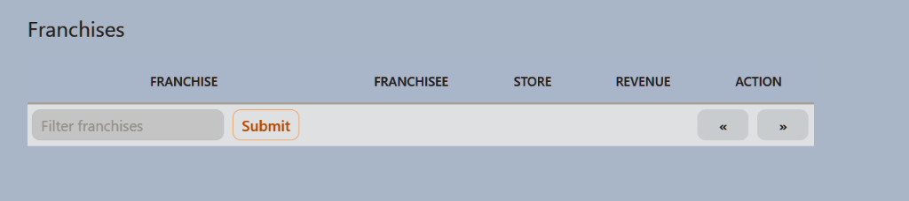
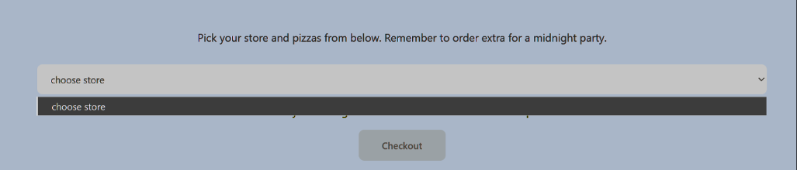
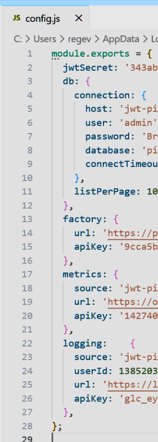
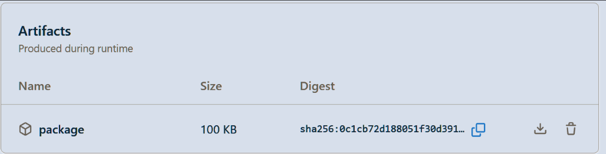
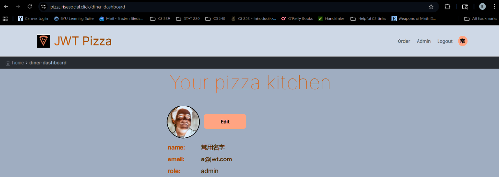

# 🛡️ Security Assessment Report

**Date:** December 6, 2025  
**Targets:** `https://pizza.braden-bledsoe.click` & `https://pizza.risesocial.click`  
**Testers:** Evan & Braden

---

## Evan’s Attacks

### Summary of Findings

| ID | Severity | Classification | Target |
| :--- | :---: | :--- | :--- |
| **1** | 2 | Improper Input Validation | `POST /api/auth` |
| **2** | 1 / 4 | Security Misconfiguration / Broken Access Control | `GET` & `DELETE /api/franchise` |
| **3** | 3 | Sensitive Data Exposure | `POST /api/auth` (Artifacts) |
| **4** | 2 | DoS / Lack of Rate Limiting | `ALL /api/` |
| **5** | 3 | Mass Assignment / Integrity Violation | `POST /api/order` |
| **6** | 4 | Hardcoded Credentials | `POST /api/auth` |

---

### Attack 1: Duplicate Registration
**Target:** `https://pizza.braden-bledsoe.click/api/auth` (POST)  
**Severity:** 2  
**Classification:** Improper Input Validation / Database Integrity Failure

**Description:**
* **Attempt:** Registering the same user credentials multiple times.
* **Result:** Was able to register with the same email multiple times and log in with those duplicate credentials.

**Images:**
n/a

**Corrections:**
* **Database Schema:** Add a `UNIQUE` constraint or index to the email column in the database to reject duplicates at the lowest level.
* **Backend Validation:** In the register endpoint, query the database for the email before creating a new user. Return `409 Conflict` if it exists.

---

### Attack 2: Franchise Misconfiguration & Broken Access
**Target:** `https://pizza.braden-bledsoe.click/api/franchise`  
**Severity:** 1 (GET) / 4 (DELETE)  
**Classification:** Security Misconfiguration & Broken Access Control

**Description:**
* **Attempt 1 (GET):** Used curl to hit the endpoint.
    ```bash
    curl -X GET "[https://pizza-service.braden-bledsoe.click/api/franchise?page=0&limit=3&name=](https://pizza-service.braden-bledsoe.click/api/franchise?page=0&limit=3&name=)*" -H "Content-Type: application/json"
    ```
* **Result 1:** Successfully accessed a list of franchises and stores. This is a potential information disclosure issue.
* **Attempt 2 (DELETE):** The delete route was missing authentication.
    ```bash
    curl -X DELETE "[https://pizza-service.braden-bledsoe.click/api/franchise/1](https://pizza-service.braden-bledsoe.click/api/franchise/1)" -H "Content-Type: application/json"
    ```
* **Result 2:** Successfully deleted franchises, impairing the store query and preventing customers from ordering.

**Images:**



**Corrections:**
* **Access Control:** Add `authRouter.authenticateToken` middleware if the data is sensitive.
* **Sanitize Output:** Strip internal IDs or metadata from public API responses.
* **Auth & Authorization:** For DELETE routes, require authentication AND an admin role check.

---

### Attack 3: Hardcoded Secrets in Artifacts
**Target:** `https://pizza.braden-bledsoe.click/api/auth` (POST)  
**Severity:** 3  
**Classification:** Sensitive Data Exposure / Hardcoded Secrets

**Description:**
* **Attempt:** Pulled config file from GitHub Actions artifacts on the public repo.
* **Result:** Successfully obtained all application secrets.

**Images:**


**Corrections:**
* **Environment Variables:** Do not include `.env` or `config.json` in build artifacts. Use GitHub Secrets.
* **Gitignore:** Ensure config files are in `.gitignore`.
* **Artifact Hygiene:** Exclude config files from the `upload-artifact` step.

---

### Attack 4: Denial of Service (DoS)
**Target:** `https://pizza.braden-bledsoe.click/api/` (ALL)  
**Severity:** 2  
**Classification:** Unrestricted Resource Consumption / Lack of Rate Limiting

**Description:**
* **Attempt:** Simulated high traffic for account creations and orders.
* **Result:** Was able to send curl requests without restriction.

**Images:**
n/a

**Corrections:**
* **Middleware:** Implement a library like `express-rate-limit` in the main `index.js` file.

---

### Attack 5: Price Manipulation (Mass Assignment)
**Target:** `https://pizza.braden-bledsoe.click/api/order` (POST)  
**Severity:** 3  
**Classification:** Broken Object Property Level Authorization / Integrity Violation

**Description:**
* **Attempt:** Send pizza order directly to API and modify the price.
    ```bash
    curl -X POST localhost:3000/api/order -H 'Content-Type: application/json' -d '{"franchiseId": 1, "storeId":1, "items":[{ "menuId": 1, "description": "Veggie", "price": 0.00001 }]}'
    ```
* **Result:** Successfully purchased a pizza for $0.00001.

**Images:**
n/a

**Corrections:**
* **Trust Source of Truth:** Never trust the price in `req.body`.
* **Backend Logic:** Iterate through items, use `menuId` to fetch the real price from the database, and calculate the total server-side.

---

### Attack 6: Hardcoded Admin Credentials
**Target:** `https://pizza.braden-bledsoe.click/api/auth` (POST)  
**Severity:** 4  
**Classification:** Use of Hardcoded Credentials / Security Misconfiguration

**Description:**
* **Attempt:** Pulled admin credentials from the default database population script (`seed.js`).
* **Result:** Gained admin access.

**Images:**
n/a

**Corrections:**
* **Remove Secrets:** Never put passwords in `seed.js`.
* **Env Variables:** Use `process.env.ADMIN_PASSWORD`.
* **Rotation:** Change the leaked password immediately and force a reset on first login.

<br>

## Braden’s Attacks

### Summary of Findings

| ID | Severity | Classification | Target |
| :--- | :---: | :--- | :--- |
| **1** | 1 | Authentication Logic Flaw | `POST /api/auth` |
| **2** | 0 | Access Control Enforcement | `GET /api/franchise` |
| **3** | 0 | Info Disclosure (Failed) | CI/CD Artifacts |
| **4** | 2 | Privilege Escalation | `PUT /api/auth` |

---

### Attack 1: Duplicate Account Creation
**Target:** `https://pizza.risesocial.click/api/auth` (POST)  
**Severity:** 1  
**Classification:** Authentication logic flaw / Duplicate account creation

**Description:**
The system allowed registering the same user credentials multiple times. This resulted in duplicate accounts tied to the same email.

**Images:**
n/a

**Corrections:**
* Enforce uniqueness constraints on the email field at both DB and application levels.

---

### Attack 2: Access Control Check
**Target:** `https://pizza.risesocial.click/api/api/franchise` (curl)  
**Severity:** 0  
**Classification:** Access control enforcement

**Description:**
Attempted to query franchise data directly via curl. The request was denied with an “Access Denied” error.

**Images:**
n/a

**Corrections:**
* No changes needed. Controls are working.

---

### Attack 3: Artifact Inspection
**Target:** GitHub Actions Artifacts  
**Severity:** 0  
**Classification:** Information disclosure attempt

**Description:**
Downloaded a build artifact and inspected configuration files. Sensitive values were protected by environment variables, so no secrets were exposed.

**Images:**


**Corrections:**
* No changes needed.

---

### Attack 4: Default Admin Abuse
**Target:** `https://pizza.risesocial.click/api/auth` (PUT)  
**Severity:** 2  
**Classification:** Privilege escalation / Default credential abuse

**Description:**
Logged in using the default admin account provided in the original repository template. Granted full administrative access (add/delete users, franchises, stores).

**Images:**


**Corrections:**
* Remove or disable default admin accounts before deployment.
* Enforce strong, unique credentials and rotate passwords.